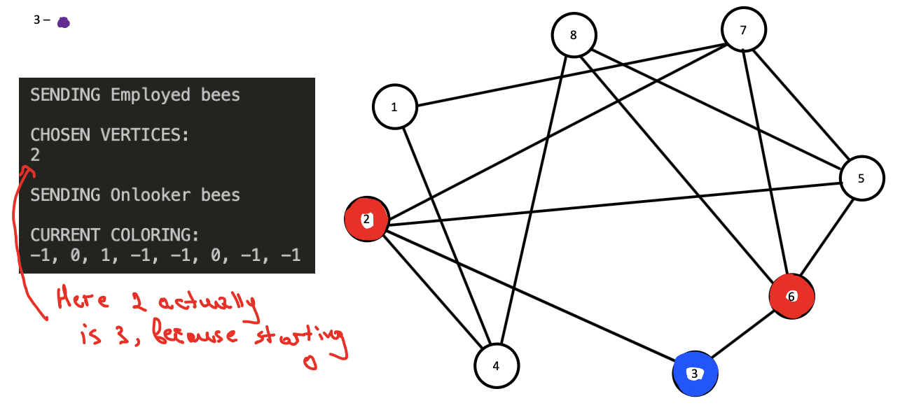
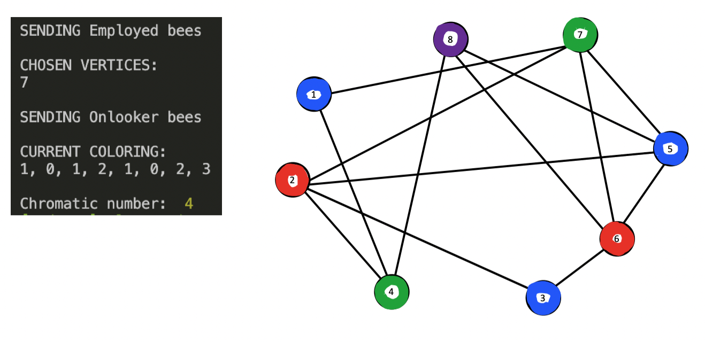

# Artificial bee colony vertex coloring

It is an implementation of artificial bee colony algorithm (ABC). This is an optimization algorithm that is based on intelligent foraging behavior of honey bee swarms

I've used this algorithm for finding a chromatic number in the graph

My work is based on this article [link](https://0m1d.com/assets/pdf/C2.pdf)

# Stats

This is the graph that represents the minimum chromatic number after a certain number of iterations.

It is for a graph with 200 vertices that has the minimum vertex degree of 1 and maximum – 20

For solving was used total of 30 bees, 2 of which were employed bees.


# Step by step solution

For better clarity, I've logged the steps of the algorithm and drew a graph, where we can see how the algorithm is working







# Install and run

1. Clone this repo
2. Make sure you have `node` installed
3. Install dependencies

```
npm install
cd client
npm install
```

4. Run the server

```
go the root directory
npm run serve
```

5. Run the client

```
cd client
npm run dev
```

6. Open the browser

```
Go the http://localhost:3000
```

## Test

```
npm test
```
